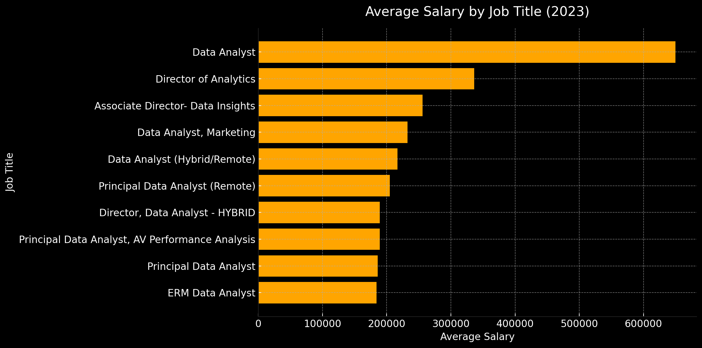
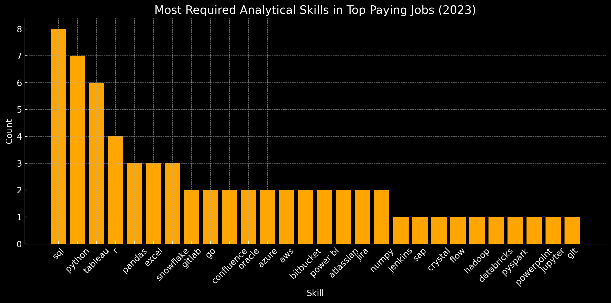
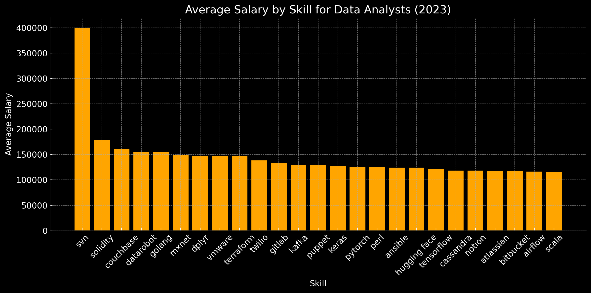
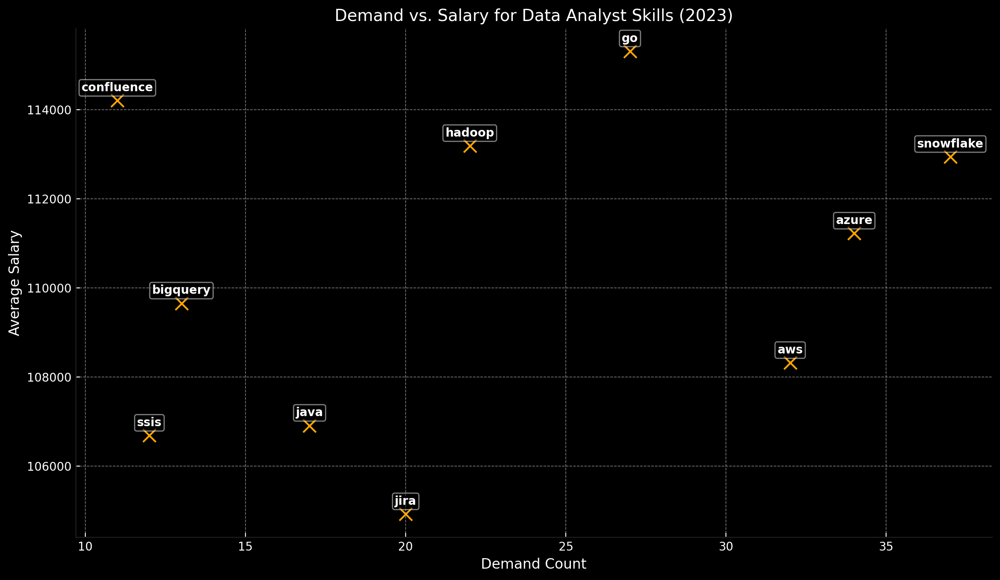

# Introduction
This project is based on Luke Barousse's [SQL Course](https://lukebarousse.com/sql). His main focus was to dive into the data job market, focusing on data analyst roles. Thus, this project explores top-paying jobs, in-demand skills, and where high demand meets high salary in data analytics.

### Here are the questions explored through SQL queries:

1. What are the top-paying data analyst jobs?
2. What skills are required for these top-paying jobs?
3. What skills are most in demand for data analysts?
4. Which skills are associated with higher salaries?
5. What are the most optimal skills to learn?

# Tools I Used

- SQL;
- PostgreSQL;
- VS Code;
- Git & GitHub.

# The Analysis

### 1. Top Paying Data Analyst Jobs
To identify the highest-paying roles, data analyst positions were filtered by average annual salary and location, with a focus on remote opportunities. This query highlights the top-paying positions in the field

```sql
SELECT
    job_id,
    job_title,
    job_location,
    job_schedule_type,
    salary_year_avg,
    job_posted_date,
    name AS company_name
FROM
    job_postings_fact
    LEFT JOIN company_dim cd USING (company_id)
WHERE
    salary_year_avg IS NOT NULL
    AND job_title_short = 'Data Analyst'
    AND job_location = 'Anywhere'
ORDER BY
    salary_year_avg DESC
LIMIT
    10;
```

Here's the breakdown of the top data analyst jobs in 2023:

- **Data Analyst Leads the Pack**: With an average salary of $650 000, the Data Analyst role stands out as the highest‑paying position among the 10 listed.

- **Middle of the Pack**: The median salary is $211 000. 5 out of 10 roles have salaries above that median, showing an even split between higher‑ and lower‑paid analytical jobs in this set.

- **Distribution Details**: The average (mean) salary is $264 506, with a standard deviation of $143 252—another sign of wide variation among positions. Salaries range from $184 000 up to $650 000.


*Bar graph visualizing the roles for the top 10 salaries for data analysts; the graph is generated by ChatGPT*

### 2. Skills for Top Paying Jobs
To understand the skills required for top-paying jobs, job postings were joined with the skills dataset, offering insights into what employers value in high-compensation roles.

```sql
SELECT
    jpf.job_id,
    job_title,
    salary_year_avg,
    name AS company_name,
    skills
FROM
    job_postings_fact jpf
    LEFT JOIN company_dim cd USING (company_id)
    JOIN skills_job_dim sjd USING (job_id)
    JOIN skills_dim sd USING (skill_id)
WHERE
    jpf.job_id IN (
        SELECT
            job_id
        FROM
            job_postings_fact
        WHERE
            salary_year_avg IS NOT NULL
            AND job_title_short = 'Data Analyst'
            AND job_location = 'Anywhere'
        ORDER BY
            salary_year_avg DESC
        LIMIT
            10
    )
ORDER BY
    salary_year_avg DESC;
```

Here's the breakdown of the most demanded skills for the top 10 highest paying data analyst jobs in 2023:

- **Top Three In‑Demand Skills**: SQL (8 listings), Python (7), and Tableau (6) lead the ranking, making them must‑have skills for high‑paying analytical roles.

- **Strong Showing for R and Pandas**: R appears 6 times and Pandas 4 times, highlighting both R’s continued presence and the importance of Python’s data‑analysis libraries.

- **BI & Cloud Tools Matter**: Tools like Excel, Snowflake, and GitLab each appear 3 times. BI platforms (Power BI at 2) and cloud platforms (AWS at 2, Azure at 2) also feature, reflecting diverse tech stacks.


*Bar graph visualizing the count of skills for the top 10 paying jobs for data analysts; the graph is generated by ChatGPT*

### 3. In-Demand Skills for Data Analysts

This query helped identify the skills most frequently requested in job postings, directing focus to areas with high demand.

```sql
SELECT
    skills,
    COUNT(jpf.job_id) AS demand_count
FROM
    job_postings_fact jpf
    JOIN skills_job_dim sjd USING (job_id)
    JOIN skills_dim sd USING (skill_id)
WHERE
    job_title_short = 'Data Analyst'
    AND job_work_from_home = TRUE
GROUP BY
    skills
ORDER BY
    demand_count DESC
LIMIT
    5;
```
Here's the breakdown of the most demanded skills for data analysts in 2023:

- **SQL Dominates**: With 7291 mentions, SQL is by far the most required skill—over 1.5× more than the next contender—underscoring its role as the lingua franca of data access.

- **Spreadsheet & Programming Pair**: Excel (4611) and Python (4330) round out the top 3, showing that fluency in both traditional spreadsheets and modern scripting remains essential.

- **BI & Visualization Tools Close Behind**: Tableau (3745) and Power BI (2609) feature prominently, reflecting widespread adoption of self‑service analytics platforms.

| Skills   | Demand Count |
|----------|--------------|
| SQL      | 7291         |
| Excel    | 4611         |
| Python   | 4330         |
| Tableau  | 3745         |
| Power BI | 2609         |

*Table of the demand for the top 5 skills in data analyst job postings*

### 4. Skills Based on Salary
Exploring the average salaries associated with different skills revealed which skills are the highest paying.

```sql
SELECT
    skills,
    ROUND(AVG(salary_year_avg)) AS avg_salary
FROM
    job_postings_fact
    JOIN skills_job_dim USING (job_id)
    JOIN skills_dim sd USING (skill_id)
WHERE
    job_title_short = 'Data Analyst'
    AND salary_year_avg IS NOT NULL
GROUP BY
    skills
ORDER BY
    avg_salary DESC
LIMIT
    25;
```
Here's a breakdown of the results for top paying skills for Data Analysts:

- **SVN Tops the List**: Subversion (SVN) leads by a wide margin with an average salary of $400 000, suggesting niche but highly valued version‑control expertise.

- **Specialized Tech Commands Premium**: Skills in Solidity ($180 000) and Couchbase ($160 000) fetch substantial pay, indicating that blockchain development and NoSQL database specialties command top dollar.

- **Broad Scripting and Infra Tools**: Datarobot, Golang, mxnet, and dbplyr (all in the $150 000–$155 000 range) show that machine‑learning platforms and efficient data pipelines remain lucrative.


*Bar graph visualizing the average salary ($) for the top 10 paying skills for data analysts; the graph is generated by ChatGPT*

### 5. Most Optimal Skills to Learn
Combining insights from demand and salary data, this query aimed to pinpoint skills that are both in high demand and have high salaries.

```sql
SELECT
    skills,
    COUNT(jpf.job_id) AS demand_count,
    ROUND(AVG(salary_year_avg)) AS avg_salary
FROM
    job_postings_fact jpf
    JOIN skills_job_dim sjd USING (job_id)
    JOIN skills_dim sd USING (skill_id)
WHERE
    job_title_short = 'Data Analyst'
    AND salary_year_avg IS NOT NULL
    AND job_work_from_home = TRUE
GROUP BY
    skills
HAVING
    COUNT(jpf.job_id) > 10
ORDER BY
    avg_salary DESC,
    demand_count DESC
LIMIT
    10;
```
Here's a breakdown of the most optimal skills for Data Analysts in 2023:

- **Modest Positive Correlation**: The demand‑vs‑salary correlation is only ~0.27, indicating that a skill’s popularity doesn’t perfectly predict its pay. High‑demand tools often pay well, but there are outliers.

- **Snowflake Reigns Supreme**: With the highest combined score (37 × $112 948 ≈ $4.2 M), Snowflake tops both demand and compensation, making it the single strongest “all‑round” skill to invest in.

- **Cloud Platforms Are Key**: Azure (#2 combined) and AWS (#3) each exceed $108 K while appearing in more than 30 job listings—underscoring that general cloud expertise is both sought‑after and well‑paid.

- **High‑Salary Specialists vs. Mass‑Market Tools**: Go ranks fourth in combined impact thanks to a $115 K average salary, even though its demand (27 listings) is lower than the top three. Conversely, Hadoop (22 listings, $113 K) shows that legacy big‑data tech still commands high pay.

- **Specialize or Generalize?**: Generalist “must‑haves” (Snowflake, Azure, AWS) dominate the high‑demand, high‑pay quadrant. Specialists (e.g., Go, Hadoop) can out‑earn or rival them in salary but require more targeted roles.


*Plot graph visualizing the most valuable skills for data analysts, comparing their demand with the average salary ($); the graph is generated by ChatGPT*

| Skills     | Demand Count | Average Salary ($) |
|------------|--------------|-------------------:|
| go         | 27           |            115,320 |
| confluence | 11           |            114,210 |
| hadoop     | 22           |            113,193 |
| snowflake  | 37           |            112,948 |
| azure      | 34           |            111,225 |
| bigquery   | 13           |            109,654 |
| aws        | 32           |            108,317 |
| java       | 17           |            106,906 |
| ssis       | 12           |            106,683 |
| jira       | 20           |            104,918 |

*Table of the most optimal skills for data analyst sorted by salary*

# Conclusions

From the analysis, several general insights emerged:

1. **Top‑Paying Analytical Roles**: Among the highest‑paying analytical positions in 2023, the generic “Data Analyst” title pulled in a remarkable salary premium—well above even director‑level analytics roles—highlighting its elevated market value despite its broad scope.

2. **Skills Powering High Salaries**: In the top‑paying analytics jobs, foundational data tools (SQL, Python, Tableau) are overwhelmingly prevalent, showing that mastery of core query, scripting, and visualization platforms remains the fastest path to premium compensation.

3. **Overall Skill Demand**: Looking across all analytics roles, SQL leads by a wide margin, followed by Excel and Python, reinforcing that proficiency in querying, spreadsheets, and scripting is nonnegotiable for the vast majority of data‑driven positions.

4. **Specialized High‑Pay Skills**: When isolating the absolute top‑earning skills, niche technologies like SVN, Solidity, and Couchbase command the highest average salaries—demonstrating that specialized expertise in version control, blockchain, and NoSQL can out‑earn more common tools.

5. **Demand × Salary Sweet Spot**: Combining frequency and pay reveals that Snowflake, Azure, and AWS offer the best balance of widespread demand and lucrative salaries—making the modern cloud/data‑warehouse stack the optimal focus for analysts aiming to maximize both opportunities and income.